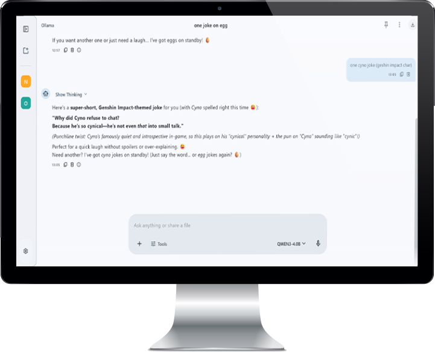
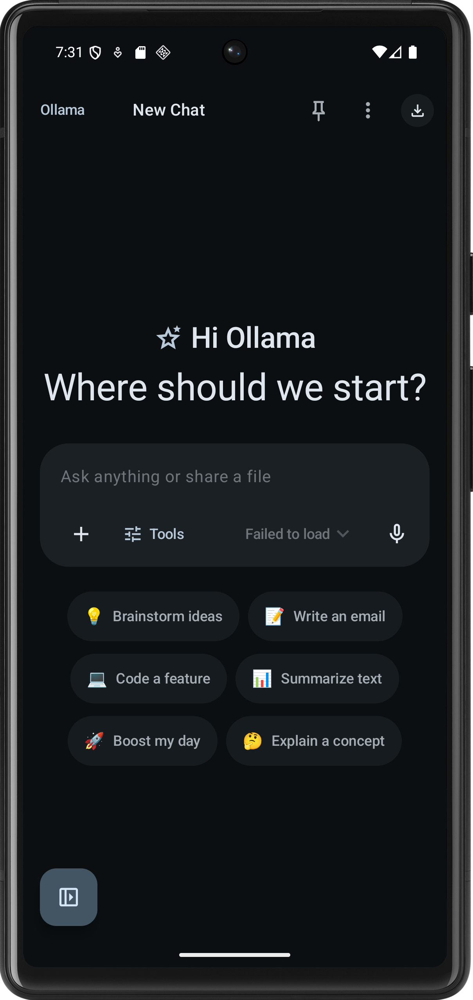

# Ollama KMP SDK

[](https://github.com/yourusername/your-repo/actions) [](https://kotlinlang.org/) [](./LICENSE)

A Kotlin Multiplatform SDK for interacting with Ollama models. Designed to work on Kotlin/JVM, Kotlin/Native (macOS, Linux), and Kotlin/JS targets — providing a common, idiomatic Kotlin API for requests, streaming, and serialization.

## Table of contents

- [Description](#description)
- [Features](#features)
- [Tech stack](#tech-stack)
- [Basic directory structure](#basic-directory-structure)
- [Installation](#installation)
- [Quick usage](#quick-usage)
- [Configuration](#configuration)
- [Screenshots](#screenshots)
- [Contributing](#contributing)
- [License](#license)
- [Thanks](#thanks)

## Description

Ollama KMP SDK provides a lightweight, multiplatform client to call Ollama models from Kotlin code. It centralizes networking, JSON serialization, streaming helpers, and multiplatform wiring so applications can use Ollama models on Android, desktop, server, and JS/Browser environments.

## Features

- Kotlin Multiplatform (common API for JVM/Native/JS)
- Simple, coroutine\-friendly request API
- Streaming responses support
- Configurable HTTP client backends per platform
- Typed requests / responses with `kotlinx.serialization`
- Small surface area for easy integration into apps and libraries

## Tech stack

- Kotlin Multiplatform (KMP)
- Gradle (Kotlin DSL) and Ant (if needed in CI)
- kotlinx\-serialization
- kotlinx\-coroutines
- ktor (or platform HTTP client adapters)
- GitHub Actions (CI)

Useful links:
- Kotlin: https://kotlinlang.org/
- Gradle: https://gradle.org/
- kotlinx\-serialization: https://github.com/Kotlin/kotlinx.serialization
- ktor: https://ktor.io/

## Basic directory structure

Example layout (KMP convention):

```
.
├── build.gradle.kts
├── settings.gradle.kts
├── gradle
├── ollama-core // api 
├── ollama-sample // gui app
├── README.md
└── LICENSE
```

## Installation

Add the SDK to your multiplatform project. Example using Gradle Kotlin DSL:

1. Add the repository where your SDK is published (e.g. Maven Central, JitPack, or GitHub Packages):
    ```bash
    gitclone "https://github.com/dontknow492/Ollama-gui.git"
    cd Ollama-gui
    git checkout main
    ```
2. gradlew build
    ```gradlew build```

Platform specific HTTP client engines (add to jvmMain, jsMain, etc.):

```kotlin
// JVM
implementation("io.ktor:ktor-client-cio:2.3.0")
// JS
implementation("io.ktor:ktor-client-js:2.3.0")
```

## Quick usage

Below is a minimal example showing how to instantiate the client and make a request. Adjust to your SDK's actual API.

```kotlin
import kotlinx.coroutines.runBlocking
import com.yourorg.ollama.OllamaClient
import com.yourorg.ollama.models.OllamaRequest

fun main() = runBlocking {
    val client = OllamaClient {
        baseUrl = "http://localhost:11434" // or remote Ollama endpoint
        apiKey = null // set if required
    }

    val request = OllamaRequest(
        model = "llama2",
        prompt = "Write a short Kotlin function that returns the fibonacci sequence up to n."
    )

    val response = client.generate(request)
    println("Response: ${response.output}")
}
```

Streaming example (coroutine flow):

```kotlin
client.streamGenerate(request).collect { chunk ->
    print(chunk.text)
}
```

## Configuration

- `baseUrl` — endpoint for the Ollama service (defaults to `http://localhost:11434`)
- `timeout` — request timeout configuration per platform
- `httpClientFactory` — inject platform HTTP client if you need custom config

(Check the SDK docs in `docs/` or KDoc for full config API.) TODO

## Screenshots

Add runtime screenshots or examples here. Example:





## Future plans
- Authorization support (API keys, tokens)
- More request/response types (e.g. embeddings, fine-tuning)
- Improved error handling and retry logic
- Additional platform support (e.g. iOS, WebAssembly)
- Better documentation and examples
- Docs site with API reference and guides
- Upload files for generation context
- Exporting messages in a format compatible with Ollama CLI

## Contributing

Contributions are welcome. Typical workflow:

1. Fork the repository
2. Create a feature branch: `git checkout -b feat/my-feature`
3. Run tests and linters
4. Open a pull request against `main`

Please follow the project's coding conventions and include tests for new features.

## License

This project is licensed under the MIT License. See `LICENSE` for details.

## Thanks

Thanks to the following projects and libraries used in this SDK:

- kotlinx\-serialization — https://github.com/Kotlin/kotlinx.serialization
- kotlinx\-coroutines — https://github.com/Kotlin/kotlinx.coroutines
- ktor — https://github.com/ktorio/ktor
- Kotlin Multiplatform community — https://kotlinlang.org/docs/multiplatform.html
- Ollama (models/service) — https://ollama.ai/

If you used any other third\-party components, add them here with links and attribution.

---

If you want, replace the placeholder URLs, versions, and examples with the real artifact coordinates and live API paths before publishing.
```